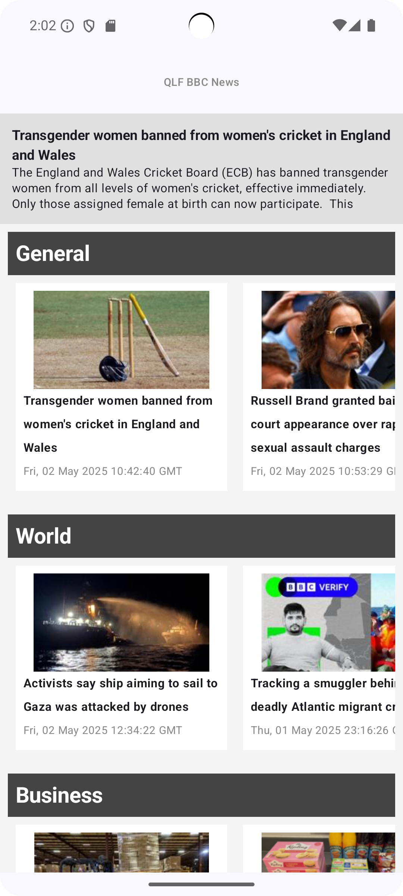
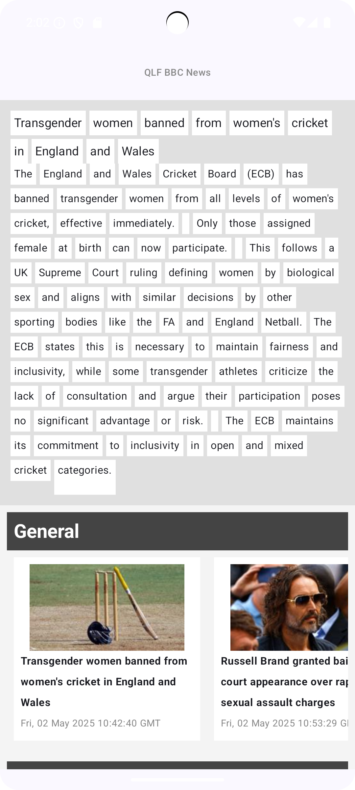
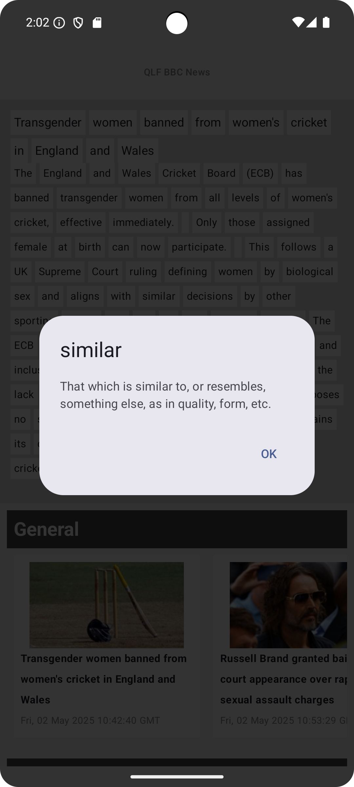
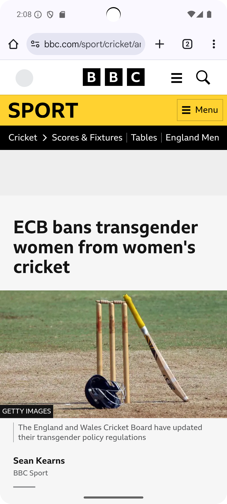

# QuickLearnFeed 📰

QuickLearnFeed is a mobile-first Android app that helps you browse categorized BBC news headlines and summaries quickly — while supporting English learning via long-press dictionary lookup.

---

## 📈 Features

* ✉️ Categorized BBC News RSS feed browsing
* ✨ AI-generated article summaries using Gemini
* 📖 English Learning Mode

  * Tap the summary to switch to word-separated mode
  * Long-press any word to instantly view its meaning
* 🚀 Clean Jetpack Compose UI
* 🌎 PWA support for mobile web usage (via Flask backend)
* ❌ Graceful error and loading state handling

---

## 🔧 Tech Stack

* Android (Kotlin, Jetpack Compose)
* StateFlow + MVVM architecture
* Ktor Client for HTTP
* Google Gemini API for summaries
* DictionaryAPI.dev for word meanings
* Flask backend (Render deployment)

---

## 🚀 Screenshots

<div align="left">

  <table>
    <tr>
      <td align="center"><strong>✉️ Normal Article View</strong></td>
      <td align="center"><strong>🔍 Tap-to-Learn</strong></td>
      <td align="center"><strong>📖 Word Meaning</strong></td>
      <td align="center"><strong>🌐 Original Page</strong></td>
    </tr>
    <tr>
      <td></td>
      <td></td>
      <td></td>
      <td></td>
    </tr>
  </table>

</div>

---

## 📚 Getting Started

1. Clone this repository:

```bash
git clone https://github.com/skimura728/QlfForA.git
```

2. Open in Android Studio (Hedgehog or newer)
3. Sync Gradle
4. Run on emulator or device

---

## 🔒 License

MIT License. See [LICENSE](LICENSE) for details.

---

## 🔐 Privacy Policy

See our [Privacy Policy](https://ginger-quicksand-7ef.notion.site/Privacy-Policy-1e37bd75009180c58b9ef8da9286eb57) for details on how we handle user data.

---

## 👋 Author

Created by [@skimura728](https://github.com/skimura728) — pull requests welcome!
